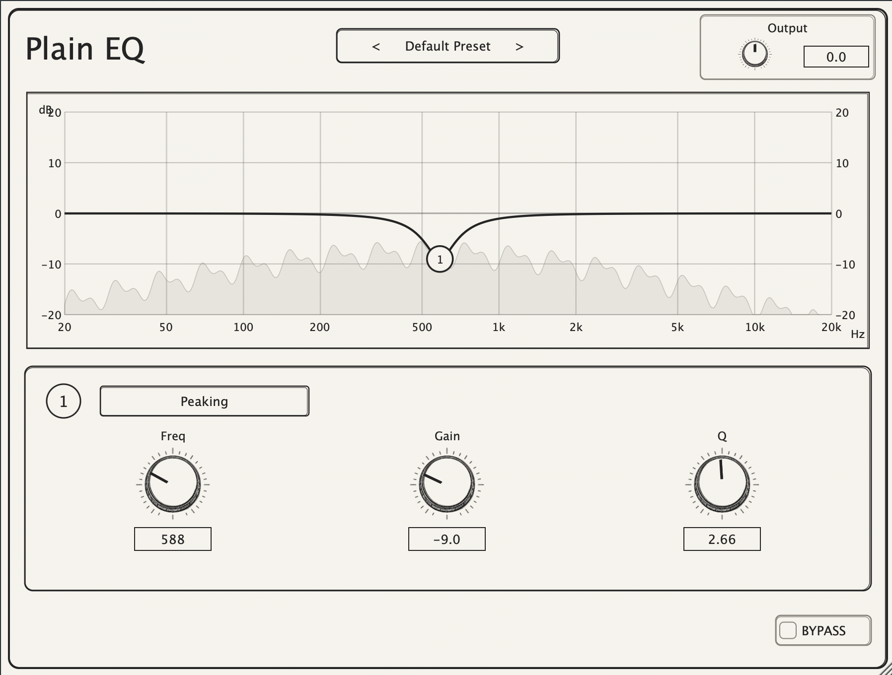

# Plain EQ

Plain EQ is a simple open-source parametric equalizer plugin built with JUCE.



It is the first project in a planned open-source mixing suite. The goal of the suite is to provide small, focused audio plugins with clear implementations and simple interfaces. Future plugins may include a compressor, limiter, gate, and other basic mixing tools.

This project intentionally keeps the feature set small: one EQ band, direct controls, a simple visual interface, and minimal complexity.

## Features

- Multi-band EQ with peaking, low-pass, and high-pass filter types
- Frequency, gain, Q, output gain, and bypass controls
- Drag-and-edit EQ node on the graph
- Per-node filter type selection from the UI
- Mouse wheel Q adjustment when the node is selected
- Live input spectrum analyzer using `juce::dsp::FFT`
- Standalone app, VST3, and AU plugin targets

## How the EQ works

Plain EQ supports multiple EQ nodes. Each node can be set to one of three filter types:

- **Peaking**: boosts or cuts around the selected frequency.
- **LPF**: low-pass filter that rolls off frequencies above the cutoff.
- **HPF**: high-pass filter that rolls off frequencies below the cutoff.

Each node has three main parameters:

- **Frequency**: chooses the center frequency of the EQ band.
- **Gain**: boosts or cuts that frequency area when using the peaking filter.
- **Q**: controls how narrow or wide the affected area is.

When the selected node is a peaking filter, gain above `0 dB` boosts around the selected frequency and gain below `0 dB` cuts around it. For LPF and HPF nodes, the gain control is disabled and frequency acts as the cutoff. Higher Q values make the filter more resonant/narrow around the cutoff. Lower Q values make it smoother.

The graph shows:

- the EQ response curve
- the selected EQ node
- the combined response of peaking, LPF, and HPF nodes
- a filled live spectrum analyzer showing the incoming audio signal

The analyzer is intentionally simple for v1: input samples are copied into a FIFO during audio processing, then the UI timer pulls those samples, runs an FFT, and draws the spectrum. Heavy drawing and allocations are avoided inside `processBlock()`.

## Requirements

- macOS
- Xcode
- JUCE available at the expected local path used by the generated Xcode project
- Command line tools: `make`, `xcodebuild`

## Build and run

List available schemes:

```sh
make list
```

Build the standalone app:

```sh
make standalone
```

Build and run the standalone app:

```sh
make run
```

Build the VST3 plugin:

```sh
make vst3
```

Build all plugin formats:

```sh
make all
```

Build a release version:

```sh
make all CONFIG=Release
```

Clean the build:

```sh
make clean
```

## Plugin formats

The project currently builds:

- Standalone app
- VST3
- AU

After building, reload or rescan the plugin in your DAW if it does not appear immediately.

## Project direction

Plain EQ is meant to be understandable and useful, not overloaded. The larger suite will follow the same idea: simple mixing plugins with focused controls, simple UIs, and open-source implementations that are easy to inspect and modify.
